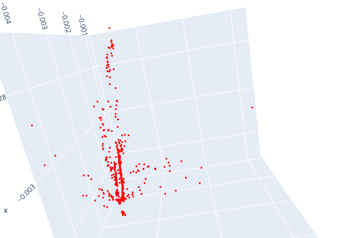
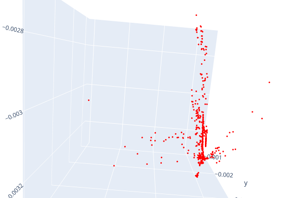
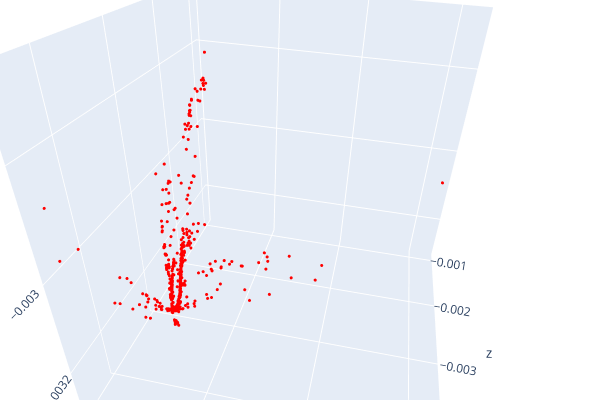

# Structure from Motion


1. Using Superglue to support better feature matching
# Match the features
kp1,kp2,matches = ImageMatch(images[0], images[1])
print(len(matches))

2. Esential and Fubndamental Matrix
[F,mask]=cv2.findFundamentalMat(kp1,kp2, method=3,ransacReprojThreshold=3.0,confidence=0.99)
[E1,mask]=cv2.findEssentialMat(kp1,kp2,cameraMatrix=K, method=cv2.RANSAC, prob=0.999, threshold=3.0 )
[E2,mask]=cv2.findEssentialMat(kp2,kp1,cameraMatrix=K, method=cv2.RANSAC, prob=0.999, threshold=3.0 )
    # R Recovered relative rotation, 3x3 matrix.
    # t Recovered relative translation, 3x1 vector.
    # good the number of inliers which pass the cheirality check.
    # mask Output mask for inliers in points1 and points2. In the output mask only inliers which pass the cheirality check. Vector of length N, see the Mask input option.
    # triangulatedPoints 3D points which were reconstructed by triangulation, see cv.triangulatePoints

3. Pose Recovery
[_, R1, t1, mask] = cv2.recoverPose(E1, kp1,kp2, cameraMatrix=K,mask=mask)    
[_, R2, t2, mask] = cv2.recoverPose(E2, kp2,kp1, cameraMatrix=K,mask=mask)  
projMatr1=np.column_stack((R1,t1))
projMatr2=np.column_stack((R2,t2))

# Given the correspondence and the projective matrix, the 3D point can be computed by
# triangulation via DLT algorithm.
# You can use the function in opencv and Matlab to recover the camera pose for triangu-
# lation.
	
4. Triangulation


mat_4D=cv2.triangulatePoints(projMatr1=projMatr1,projMatr2=projMatr2,projPoints1=kp1,projPoints2=kp2).astype(np.float64)
mat_3D = mat_4D[:3,:]
#changing to 3D according to since we require projection in 3D space.  they're just 3D points in a 4D projective space, analogous to 2D points in a 3D projective space. all points (x,y,z,1) * w, for arbitrary nonzero w, 
# in the projective space represent the same 3D point (x,y,z), and (x,y,z,1) is the canonical representative.
# https://stackoverflow.com/questions/69429075/what-could-be-the-reason-for-triangulation-3d-points-to-result-in-a-warped-para

5. PnP 
# Given 2D-3D correspondences and the intrinsic parameter, estimate a camera pose using
# linear least squares. 

points_2D=kp1
mat_3D=mat_3D.T
dist_coeffs = np.zeros((4,1)).astype(np.float64)
success, vector_rotation, vector_translation=cv2.solvePnP(mat_3D,points_2D,K,dist_coeffs,R1,t1)

6. Optimization
example=mat_3D[0,:]
example_point, jacobian = cv2.projectPoints(
    mat_3D,
    vector_rotation,
    vector_translation,
    K,
    dist_coeffs,
)
# print(example_point)


## 7. Visualization
Open3d point cloud
print("Load a ply point cloud, print it, and render it")
pcd = o3d.geometry.PointCloud()


## 8. Datasets


## Results
Datasets processed in the file Dataload.py
 ### TempleRing


 
 ### LLFF
 Intrinsic matrix constructed from pose information:

 ```python
  K=np.array([[fx,0,cx], [0 ,fy, cy],[0, 0, 1]]).astype(np.float64)  ##intrinsic matrix
```
# RMSE calculation

```python
def RMSE(r):
return np.power(r-r0.flatten(),2) ##error function for least squares
```






