# Structure from Motion

Environment variables found in principles.yml (conda env)

### 1. Using Superglue to support better feature matching
FeatureMatching.py 


### 2. Esential and Fubndamental Matrix
Below Code is found in main.py


```python
[F,mask]=cv2.findFundamentalMat(kp1,kp2, method=3,ransacReprojThreshold=3.0,confidence=0.99)
[E1,mask]=cv2.findEssentialMat(kp1,kp2,cameraMatrix=K, method=cv2.RANSAC, prob=0.999, threshold=3.0 )
[E2,mask]=cv2.findEssentialMat(kp2,kp1,cameraMatrix=K, method=cv2.RANSAC, prob=0.999, threshold=3.0 )
```


### 3. Pose Recovery
 ```python
[_, R1, t1, mask] = cv2.recoverPose(E1, kp1,kp2, cameraMatrix=K,mask=mask)    
[_, R2, t2, mask] = cv2.recoverPose(E2, kp2,kp1, cameraMatrix=K,mask=mask)  
projMatr1=np.column_stack((R1,t1))
projMatr2=np.column_stack((R2,t2))
```
R Recovered relative rotation, 3x3 matrix.
t Recovered relative translation, 3x1 vector.

mask Output mask for inliers in points1 and points2. In the output mask only inliers which pass the cheirality check. 
	
### 4. Triangulation
```python
mat_4D=cv2.triangulatePoints(projMatr1=projMatr1,projMatr2=projMatr2,projPoints1=kp1,projPoints2=kp2).astype(np.float64)

mat_3D = mat_4D[:,:3]/mat_4D[:,3:4]
```
changing to 3D according to since we require projection in 3D space.  they're just 3D points in a 4D projective space, analogous to 2D points in a 3D projective space. all points (x,y,z,1) * w, for arbitrary nonzero w, 
 in the projective space represent the same 3D point (x,y,z), and (x,y,z,1) is the canonical representative.
 https://stackoverflow.com/questions/69429075/what-could-be-the-reason-for-triangulation-3d-points-to-result-in-a-warped-para

###  5. PnP 
used solvePnPRefineLM() for better control of outliers
```python
r, t=solvePnPRefineLM()(points_3D,points_2D,K,dist_coeffs,r1,t1,criteria=criteria)
R,jacobian=cv2.Rodrigues(r)
pnp_mat=np.hstack([R,t])
CurrentPose=np.dot(K,pnp_mat)
```

### 6. Optimization
Least squares with soft l1 loss: rho(z) = 2 * ((1 + z)**0.5 - 1)
```python
res1=least_squares(RMSE, r.flatten(),jac='2-point', method='dogbox',loss='soft_l1',max_nfev=2000) #implemented least square optimization
 
```
### 6. Bundle Adjustment
Breadth search based on the number of matched features. Sorted by the most number of features and expanded.

### 7. Visualization
Open3d point cloud
print("Load a ply point cloud, print it, and render it")
pcd = o3d.geometry.PointCloud()


### 8. Results


Datasets processed in the file Dataload.py

 ### TempleRing
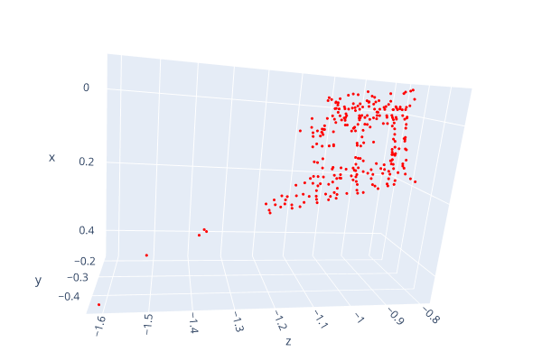
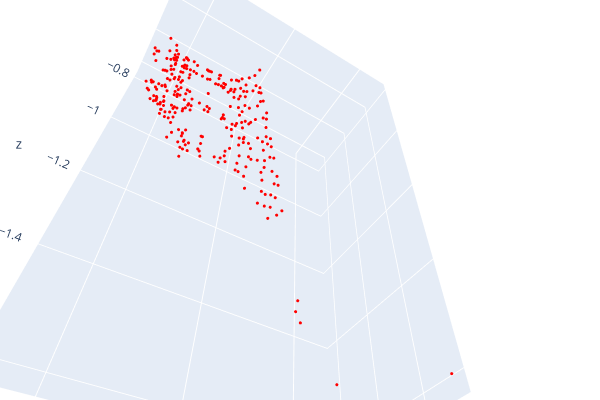
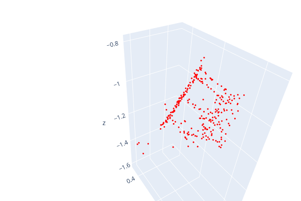
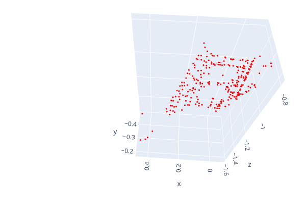
 
 ### LLFF
 Intrinsic matrix constructed from pose information:

 ```python
  K=np.array([[fx,0,cx], [0 ,fy, cy],[0, 0, 1]]).astype(np.float64)  ##intrinsic matrix
```
### RMSE calculation

```python
RMSE_r+=sum(np.power(r.flatten()-r0.flatten(),2)) #calculate RMSE r and update
TOTAL_RMSE_r =  np.sqrt( (1/len(images)**2)* RMSE_r)
```

RMSE for TRex rotation matrix:
RMSE for TRex translation vector: 

```python
--------------------------------------------------------------------------------
Loaded 54 poses from: kitti_trex_gt.txt
Loaded 54 poses from: kitti_trex_00.txt
--------------------------------------------------------------------------------
Aligning using Umeyama's method...
Rotation of alignment:
[[ 0.44750528  0.89419974 -0.01207684]
 [ 0.72676047 -0.37151271 -0.57775213]
 [-0.5211125   0.24977015 -0.81612293]]
Translation of alignment:
[ 45.31216322 -10.67234959   6.78472044]
Scale correction: 1.0
--------------------------------------------------------------------------------
Compared 54 absolute pose pairs.
Calculating APE for translation part pose relation...
--------------------------------------------------------------------------------
APE w.r.t. translation part (m)
(with SE(3) Umeyama alignment)

       max      537.908827
      mean      172.434304
    median      53.996346
       min      32.582834
      rmse      243.921671
       sse      3212880.198135
       std      172.523020
```
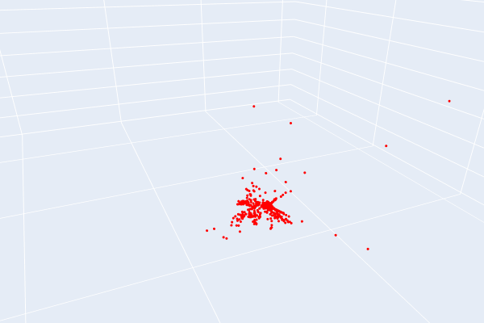
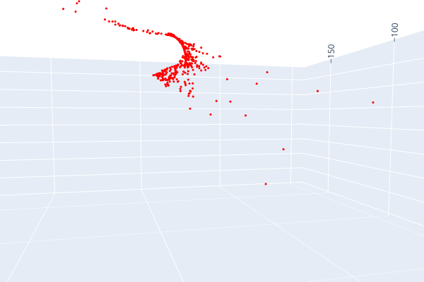
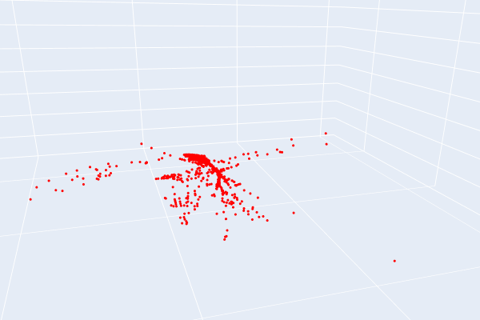
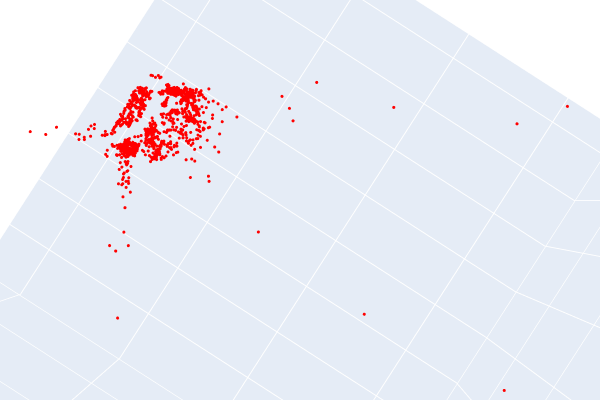
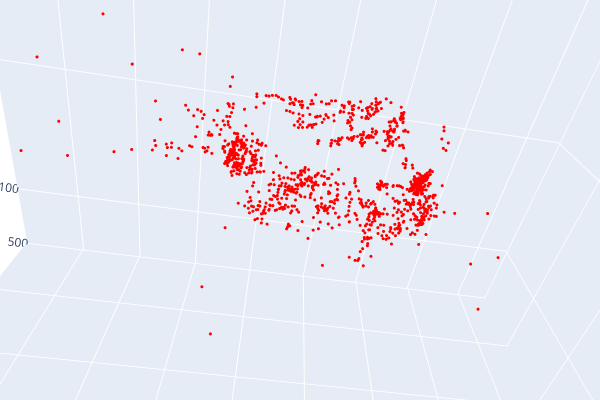

RMSE for Fern rotation matrix:
RMSE for Fern translation vector: 
```python

```
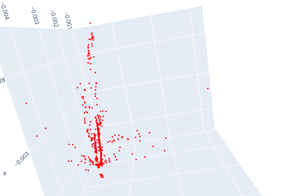
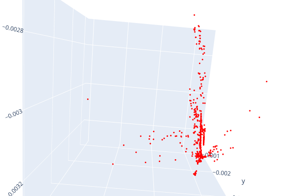
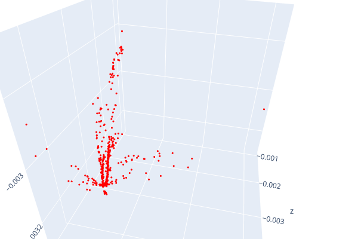

